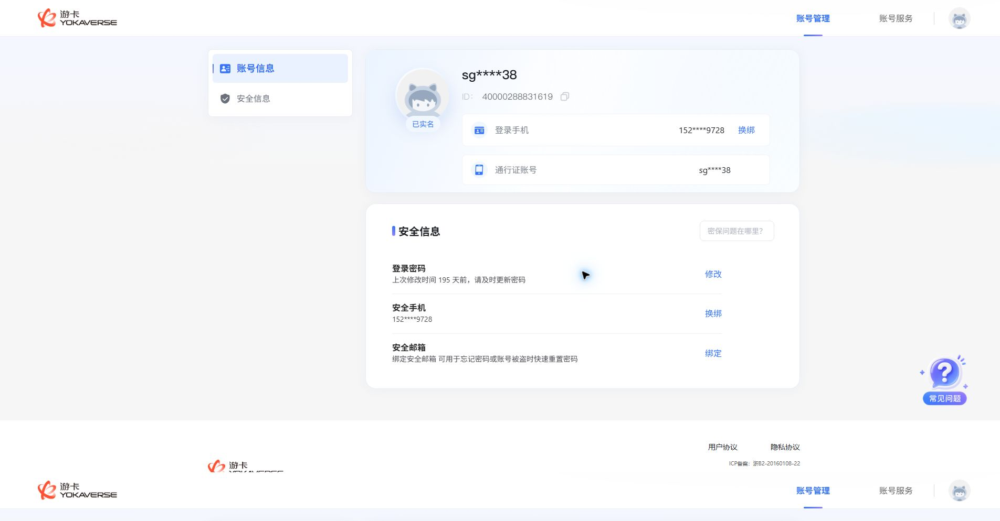
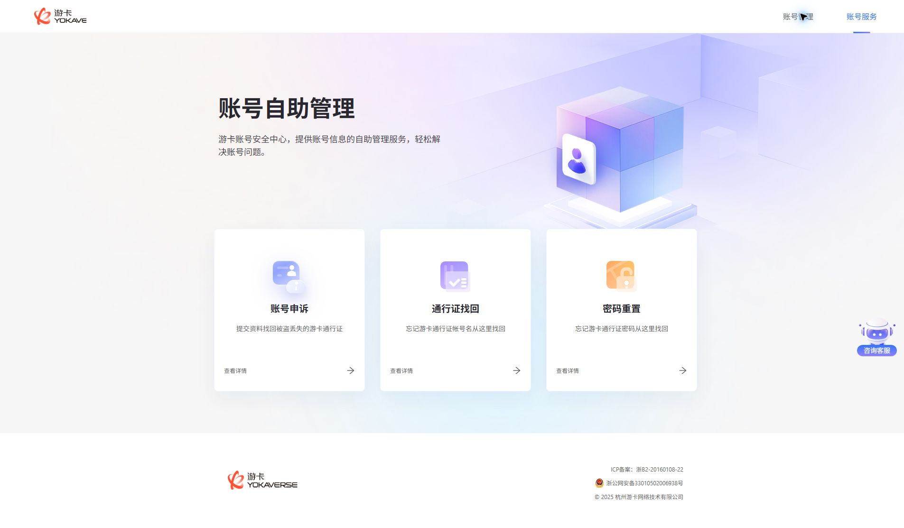
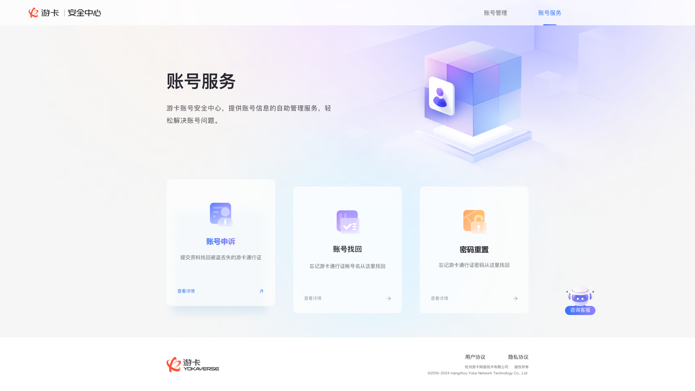
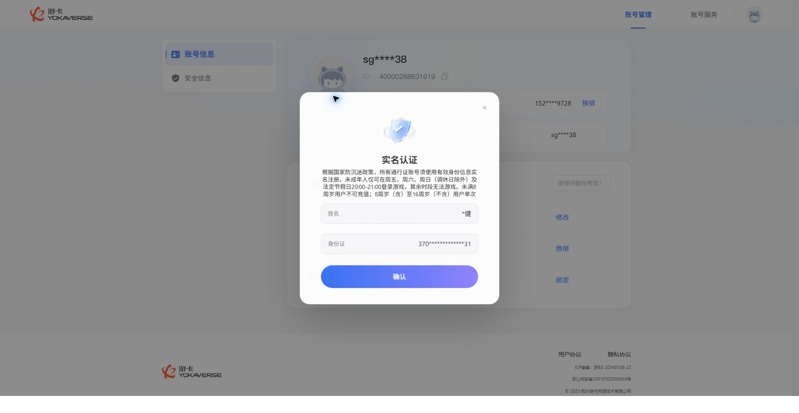
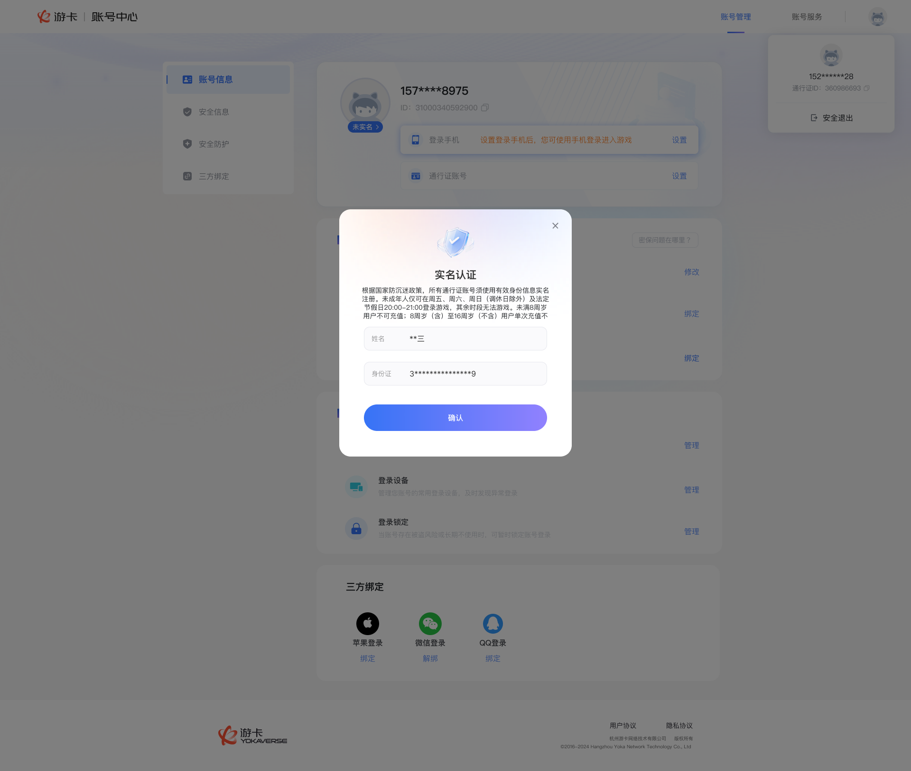
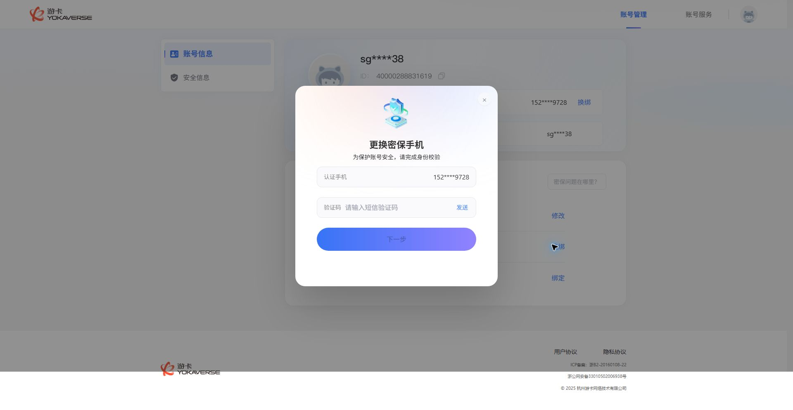
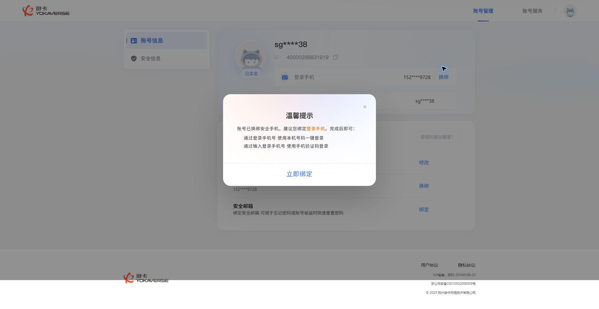
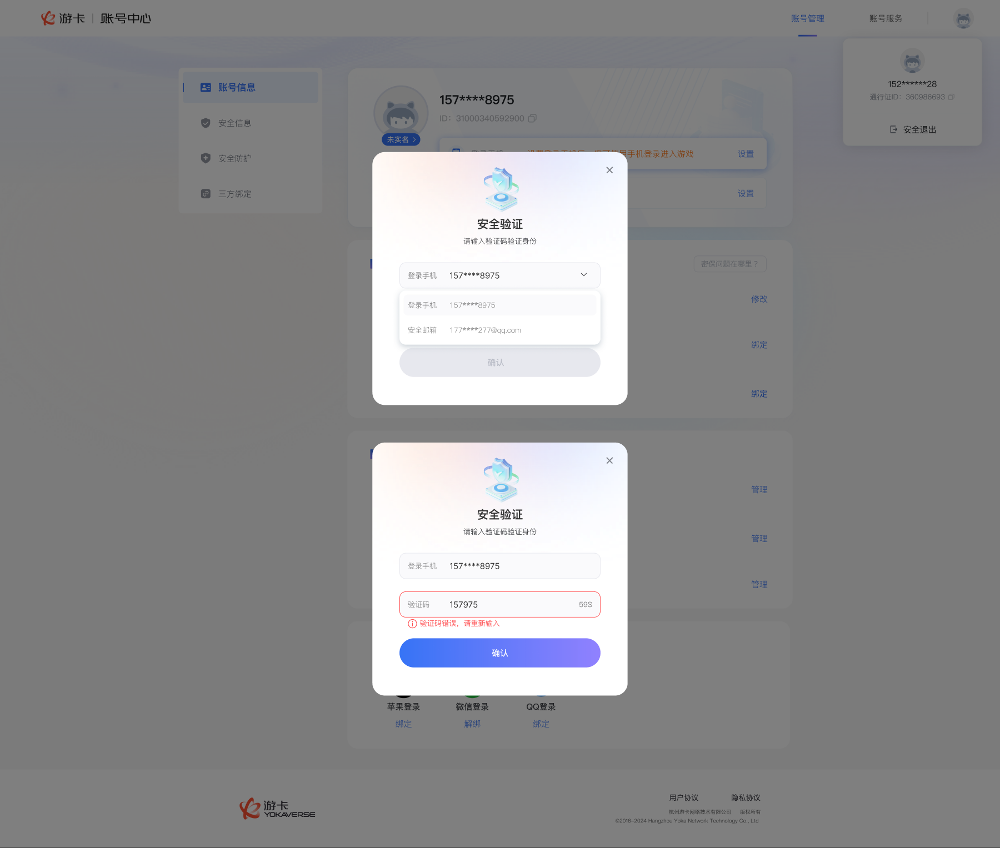
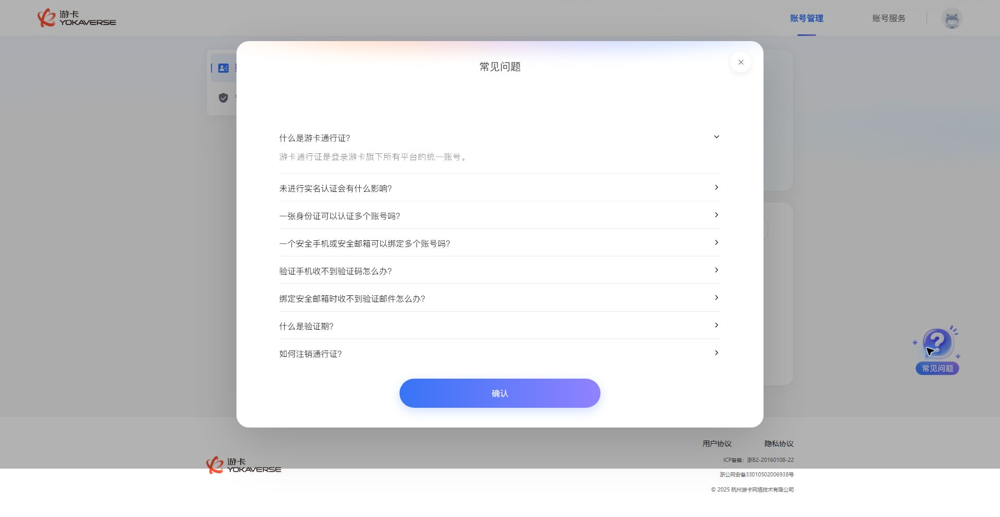
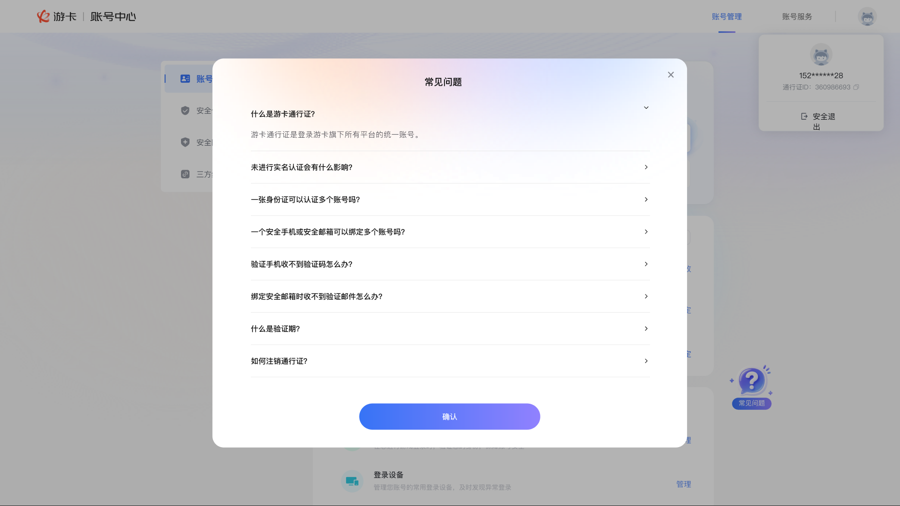

# 国内游卡账号中心 UI 验收报告 - 账号中心像素复核

## 1. 本轮信息

| 项目 | 内容 |
| --- | --- |
| 验收时间 | 2026-05-26 14:19:04 +08:00（Asia/Shanghai） |
| 验收对象 | 当前登录态账号中心首页、当前“账号服务”入口页及首页可触发弹窗 |
| 页面/路由 | `https://account-test.yokaverse.com/?extra=%7B%22login_type%22%3A%22password%22%7D` |
| Chrome 当前页确认 | 本轮通过 Chrome 当前登录态标签读取到标题 `游卡--安全中心` 与上述 URL |
| Figma 文件 | [国内-游卡账号中心](https://www.figma.com/design/zdbqXSiRNRL373XDbQSnht/%E5%9B%BD%E5%86%85-%E6%B8%B8%E5%8D%A1%E8%B4%A6%E5%8F%B7%E4%B8%AD%E5%BF%83) |
| Figma MCP 连通性 | 通过：本轮成功调用 `get_variable_defs(fileKey=zdbqXSiRNRL373XDbQSnht, nodeId=44163:1939)`，返回 `{}`；随后成功调用多个 `get_design_context` 与 `get_screenshot` |
| 验收方法 | 依照 `ui-design-qa` 的五维口径：文案、图标、颜色、间距、字体；仅使用 `通过`、`不通过`、`未验证` |

本期范围说明：

- 首页模块按抽样验收执行，报告中会明确标注 `抽样`
- 本期不以 `安全防护` 与 `三方绑定` 是否上线作为首页不通过依据

## 2. 五维结果总表

状态标识：![通过][status-pass]、![不通过][status-fail]、![未验证][status-pending]

| 页面/弹窗 | 文案 | 图标 | 颜色 | 间距 | 字体 | 综合结果 | 主要证据 |
| --- | --- | --- | --- | --- | --- | --- | --- |
| 顶部导航跨页（`/` vs `/security`） | ![通过][status-pass] | ![通过][status-pass] | ![通过][status-pass] | ![不通过][status-fail] | ![不通过][status-fail] | ![不通过][status-fail] | `pic/ui-live-topnav-and-sampled-modules-20260526.json`；`pic/uiqa-account-service-navigation.png`；Figma [43644:1047](https://www.figma.com/design/zdbqXSiRNRL373XDbQSnht/%E5%9B%BD%E5%86%85-%E6%B8%B8%E5%8D%A1%E8%B4%A6%E5%8F%B7%E4%B8%AD%E5%BF%83?node-id=43644-1047) |
| 首页安全信息模块抽样（登录密码/安全手机/安全邮箱） | ![通过][status-pass] | ![通过][status-pass] | ![不通过][status-fail] | ![未验证][status-pending] | ![不通过][status-fail] | ![不通过][status-fail] | `pic/ui-live-topnav-and-sampled-modules-20260526.json`；Figma [44163:1989](https://www.figma.com/design/zdbqXSiRNRL373XDbQSnht/%E5%9B%BD%E5%86%85-%E6%B8%B8%E5%8D%A1%E8%B4%A6%E5%8F%B7%E4%B8%AD%E5%BF%83?node-id=44163-1989)、[44163:1988](https://www.figma.com/design/zdbqXSiRNRL373XDbQSnht/%E5%9B%BD%E5%86%85-%E6%B8%B8%E5%8D%A1%E8%B4%A6%E5%8F%B7%E4%B8%AD%E5%BF%83?node-id=44163-1988)、[44163:1994](https://www.figma.com/design/zdbqXSiRNRL373XDbQSnht/%E5%9B%BD%E5%86%85-%E6%B8%B8%E5%8D%A1%E8%B4%A6%E5%8F%B7%E4%B8%AD%E5%BF%83?node-id=44163-1994) |
| 登录手机信息行（绑定态，抽样） | ![通过][status-pass] | ![通过][status-pass] | ![通过][status-pass] | ![不通过][status-fail] | ![不通过][status-fail] | ![不通过][status-fail] | `pic/ui-live-account-home-computed-20260526.json`；Figma [43464:2973](https://www.figma.com/design/zdbqXSiRNRL373XDbQSnht/%E5%9B%BD%E5%86%85-%E6%B8%B8%E5%8D%A1%E8%B4%A6%E5%8F%B7%E4%B8%AD%E5%BF%83?node-id=43464-2973) |
| 实名认证查看弹窗 | ![通过][status-pass] | ![通过][status-pass] | ![未验证][status-pending] | ![未验证][status-pending] | ![未验证][status-pending] | ![未验证][status-pending] | `pic/uiqa-realname-dialog-current.png` vs `pic/figma-2026-05-26-realname-dialog.png`；`pic/ui-tc013-realname-view.json` |
| 安全手机换绑验证弹窗 | ![不通过][status-fail] | ![未验证][status-pending] | ![未验证][status-pending] | ![未验证][status-pending] | ![未验证][status-pending] | ![不通过][status-fail] | `pic/uiqa-security-phone-change-verification.png`；`pic/ui-change-entry-results.json`；Figma [43469:14661](https://www.figma.com/design/zdbqXSiRNRL373XDbQSnht/%E5%9B%BD%E5%86%85-%E6%B8%B8%E5%8D%A1%E8%B4%A6%E5%8F%B7%E4%B8%AD%E5%BF%83?node-id=43469-14661) |
| 安全邮箱绑定验证弹窗 | ![不通过][status-fail] | ![未验证][status-pending] | ![未验证][status-pending] | ![未验证][status-pending] | ![未验证][status-pending] | ![不通过][status-fail] | `pic/uiqa-security-email-bind-verification.png`；`pic/ui-targeted-control-results.json`；Figma [43592:1309](https://www.figma.com/design/zdbqXSiRNRL373XDbQSnht/%E5%9B%BD%E5%86%85-%E6%B8%B8%E5%8D%A1%E8%B4%A6%E5%8F%B7%E4%B8%AD%E5%BF%83?node-id=43592-1309) |
| 常见问题弹窗 | ![通过][status-pass] | ![未验证][status-pending] | ![未验证][status-pending] | ![未验证][status-pending] | ![未验证][status-pending] | ![未验证][status-pending] | `pic/uiqa-faq-dialog-current.png` vs `pic/figma-2026-05-26-faq-dialog.png`；`pic/ui-faq-current-results.json` |

## 3. 问题清单

| 编号 | 状态 | 页面/弹窗 | 维度 | 问题描述 | 证据 |
| --- | --- | --- | --- | --- | --- |
| QA-20260526-001 | ![不通过][status-fail] | 顶部导航跨页（`/` vs `/security`） | 间距/字体 | 同一组 `账号管理/账号服务` 顶部导航在两页的按钮宽度、整体位置、Logo 占位和文字行高不一致；首页 `账号管理` 还使用了更重的字重。 | `pic/ui-live-topnav-and-sampled-modules-20260526.json`；`pic/uiqa-account-service-navigation.png`；[设计节点 43644:1047](https://www.figma.com/design/zdbqXSiRNRL373XDbQSnht/%E5%9B%BD%E5%86%85-%E6%B8%B8%E5%8D%A1%E8%B4%A6%E5%8F%B7%E4%B8%AD%E5%BF%83?node-id=43644-1047) |
| QA-20260526-002 | ![不通过][status-fail] | 首页安全信息模块抽样 | 颜色/字体 | 抽样项 `登录密码`、`安全手机`、`安全邮箱` 的标题设计为 `#3c3f44 + Medium`，线上实测为 `rgba(0,0,0,0.85) + 600`。 | `pic/ui-live-topnav-and-sampled-modules-20260526.json`；[设计节点 44163:1989](https://www.figma.com/design/zdbqXSiRNRL373XDbQSnht/%E5%9B%BD%E5%86%85-%E6%B8%B8%E5%8D%A1%E8%B4%A6%E5%8F%B7%E4%B8%AD%E5%BF%83?node-id=44163-1989)、[44163:1988](https://www.figma.com/design/zdbqXSiRNRL373XDbQSnht/%E5%9B%BD%E5%86%85-%E6%B8%B8%E5%8D%A1%E8%B4%A6%E5%8F%B7%E4%B8%AD%E5%BF%83?node-id=44163-1988)、[44163:1994](https://www.figma.com/design/zdbqXSiRNRL373XDbQSnht/%E5%9B%BD%E5%86%85-%E6%B8%B8%E5%8D%A1%E8%B4%A6%E5%8F%B7%E4%B8%AD%E5%BF%83?node-id=44163-1994) |
| QA-20260526-003 | ![不通过][status-fail] | 登录手机信息行（绑定态） | 间距/字体 | 行容器实测为 `587x62`，设计为 `628x60`；文本 `line-height` 实测 `24px`，设计为 `28px`。 | `pic/ui-live-account-home-computed-20260526.json`；[设计节点 43464:2973](https://www.figma.com/design/zdbqXSiRNRL373XDbQSnht/%E5%9B%BD%E5%86%85-%E6%B8%B8%E5%8D%A1%E8%B4%A6%E5%8F%B7%E4%B8%AD%E5%BF%83?node-id=43464-2973) |
| QA-20260526-004 | ![不通过][status-fail] | 安全手机换绑验证弹窗 | 文案 | 线上使用 `更换密保手机`、`认证手机`，设计使用 `安全验证`、`安全手机`。 | [设计节点 43469:14661](https://www.figma.com/design/zdbqXSiRNRL373XDbQSnht/%E5%9B%BD%E5%86%85-%E6%B8%B8%E5%8D%A1%E8%B4%A6%E5%8F%B7%E4%B8%AD%E5%BF%83?node-id=43469-14661)；`pic/ui-change-entry-results.json`；`pic/uiqa-security-phone-change-verification.png` |
| QA-20260526-005 | ![不通过][status-fail] | 安全邮箱绑定验证弹窗 | 文案 | 线上使用 `绑定密保邮箱`、`认证手机`，设计入口态使用 `安全验证`、`登录手机`。 | [设计节点 43592:1309](https://www.figma.com/design/zdbqXSiRNRL373XDbQSnht/%E5%9B%BD%E5%86%85-%E6%B8%B8%E5%8D%A1%E8%B4%A6%E5%8F%B7%E4%B8%AD%E5%BF%83?node-id=43592-1309)；`pic/ui-targeted-control-results.json`；`pic/uiqa-security-email-bind-verification.png` |

## 4. 结论

本轮按最新确认范围重算后，已移除“安全防护 / 三方绑定未上线”这类不属于本期的问题，首页改为抽样验收。当前明确不通过的重点为 5 项：顶部导航跨页不一致、首页安全信息模块抽样标题的颜色/字重偏差、登录手机信息行的尺寸与行高偏差、安全手机换绑弹窗术语不一致、安全邮箱绑定验证弹窗术语不一致。实名认证查看弹窗的文案与可见图标通过，FAQ 文案按精确设计节点通过。

剩余 `未验证` 已进一步收窄，主要只剩弹窗颜色/间距/字体，以及首页抽样标题节点无法外推出整行间距的部分。当前 Chrome 登录态页的“定点局部样式读取”已经能稳定覆盖顶部导航、首页抽样模块和登录手机信息行，因此报告不再把这些项笼统地写成 `未验证`。

## 5. 使用的 Figma 节点

| 状态/组件 | 节点 | 本轮设计证据 |
| --- | --- | --- |
| 首页示例画布 | [43468:1725](https://www.figma.com/design/zdbqXSiRNRL373XDbQSnht/%E5%9B%BD%E5%86%85-%E6%B8%B8%E5%8D%A1%E8%B4%A6%E5%8F%B7%E4%B8%AD%E5%BF%83?node-id=43468-1725) | [figma-2026-05-26-home-example.png](./pic/figma-2026-05-26-home-example.png)；成功拉取结构上下文 |
| 账号服务入口页 | [43644:1047](https://www.figma.com/design/zdbqXSiRNRL373XDbQSnht/%E5%9B%BD%E5%86%85-%E6%B8%B8%E5%8D%A1%E8%B4%A6%E5%8F%B7%E4%B8%AD%E5%BF%83?node-id=43644-1047) | [figma-2026-05-26-account-service-entry.png](./pic/figma-2026-05-26-account-service-entry.png)；顶部导航栏、Logo、`账号管理/账号服务` 选中态 |
| 账号信息 Tab | [44163:1939](https://www.figma.com/design/zdbqXSiRNRL373XDbQSnht/%E5%9B%BD%E5%86%85-%E6%B8%B8%E5%8D%A1%E8%B4%A6%E5%8F%B7%E4%B8%AD%E5%BF%83?node-id=44163-1939) | [figma-2026-05-26-account-tab.png](./pic/figma-2026-05-26-account-tab.png)；`#3774f6`、18px、Semibold |
| 安全信息 Tab | [44163:1945](https://www.figma.com/design/zdbqXSiRNRL373XDbQSnht/%E5%9B%BD%E5%86%85-%E6%B8%B8%E5%8D%A1%E8%B4%A6%E5%8F%B7%E4%B8%AD%E5%BF%83?node-id=44163-1945) | [figma-2026-05-26-security-tab.png](./pic/figma-2026-05-26-security-tab.png)；`#6b707b`、16px、Regular |
| 登录密码标题 | [44163:1989](https://www.figma.com/design/zdbqXSiRNRL373XDbQSnht/%E5%9B%BD%E5%86%85-%E6%B8%B8%E5%8D%A1%E8%B4%A6%E5%8F%B7%E4%B8%AD%E5%BF%83?node-id=44163-1989) | `#3c3f44`、16px、Medium、20px line-height |
| 安全手机标题 | [44163:1988](https://www.figma.com/design/zdbqXSiRNRL373XDbQSnht/%E5%9B%BD%E5%86%85-%E6%B8%B8%E5%8D%A1%E8%B4%A6%E5%8F%B7%E4%B8%AD%E5%BF%83?node-id=44163-1988) | `#3c3f44`、16px、Medium、20px line-height |
| 安全邮箱标题 | [44163:1994](https://www.figma.com/design/zdbqXSiRNRL373XDbQSnht/%E5%9B%BD%E5%86%85-%E6%B8%B8%E5%8D%A1%E8%B4%A6%E5%8F%B7%E4%B8%AD%E5%BF%83?node-id=44163-1994) | `#3c3f44`、16px、Medium、20px line-height |
| 登录手机信息行（绑定态） | [43464:2973](https://www.figma.com/design/zdbqXSiRNRL373XDbQSnht/%E5%9B%BD%E5%86%85-%E6%B8%B8%E5%8D%A1%E8%B4%A6%E5%8F%B7%E4%B8%AD%E5%BF%83?node-id=43464-2973) | 结构上下文：60px 高、8px 圆角、`#edf4fa` 边框、标签/值/换绑动作 |
| 实名查看弹窗 | [43983:1180](https://www.figma.com/design/zdbqXSiRNRL373XDbQSnht/%E5%9B%BD%E5%86%85-%E6%B8%B8%E5%8D%A1%E8%B4%A6%E5%8F%B7%E4%B8%AD%E5%BF%83?node-id=43983-1180) | [figma-2026-05-26-realname-dialog.png](./pic/figma-2026-05-26-realname-dialog.png)；弹窗 490x522、标题/实名说明/字段/确认按钮 |
| 安全手机换绑安全验证 | [43469:14661](https://www.figma.com/design/zdbqXSiRNRL373XDbQSnht/%E5%9B%BD%E5%86%85-%E6%B8%B8%E5%8D%A1%E8%B4%A6%E5%8F%B7%E4%B8%AD%E5%BF%83?node-id=43469-14661) | [figma-2026-05-26-security-phone-verify.png](./pic/figma-2026-05-26-security-phone-verify.png)；标题 `安全验证`、字段 `安全手机` |
| 安全邮箱绑定安全验证 | [43592:1309](https://www.figma.com/design/zdbqXSiRNRL373XDbQSnht/%E5%9B%BD%E5%86%85-%E6%B8%B8%E5%8D%A1%E8%B4%A6%E5%8F%B7%E4%B8%AD%E5%BF%83?node-id=43592-1309) | [figma-2026-05-26-security-email-verify.png](./pic/figma-2026-05-26-security-email-verify.png)；标题 `安全验证`、字段 `登录手机` |
| 常见问题弹窗 | [43981:13831](https://www.figma.com/design/zdbqXSiRNRL373XDbQSnht/%E5%9B%BD%E5%86%85-%E6%B8%B8%E5%8D%A1%E8%B4%A6%E5%8F%B7%E4%B8%AD%E5%BF%83?node-id=43981-13831) | [figma-2026-05-26-faq-dialog.png](./pic/figma-2026-05-26-faq-dialog.png)；标题、8 条问题及首条展开答案 |

## 6. 分页面对比明细

### 6.1 顶部导航跨页（账号管理页 `/` 与账号服务页 `/security`）

| 维度 | 结果 | 对比说明 |
| --- | --- | --- |
| 文案 | ![通过][status-pass] | 当前线上两页均为 `账号管理` / `账号服务` 这组导航文案，未出现错字、缺字或增字。 |
| 图标 | ![通过][status-pass] | 以样式一致性为准复核，线上两页均保留左上品牌 Logo，未出现缺失或错误替换；本项不再要求图标资产 ID 逐一匹配。 |
| 颜色 | ![通过][status-pass] | `账号服务` 入口设计中，未选中项为 `#666`、选中项为 `#3774f6`。线上 `/security` 实页读取到 `账号管理` 为 `rgb(102,102,102)`、`账号服务` 为 `rgb(55,116,246)`，与设计一致；首页 `/` 亦保持蓝色选中态。 |
| 间距 | ![不通过][status-fail] | 当前线上两页顶部导航布局不一致：首页 `/` 导航容器为 `246x69`、起点 `x=1490`，账号管理/账号服务各宽 `88px`；`/security` 导航容器为 `198x70`、起点 `x=1635`，两个按钮各宽 `64px`。Figma `43644:1047` 的账号服务页导航组位于 `right=353, top=27`，Logo 为 `208x38`。线上跨页切换后按钮位置和 Logo 占位明显变化。 |
| 字体 | ![不通过][status-fail] | 首页 `/` 当前选中的 `账号管理` 实测为 `16px / 600 / line-height 16px`；`/security` 页 `账号服务` 为 `16px / 400 / line-height 40px`。同一套顶部导航在跨页后字重与行高不一致，不符合统一导航样式预期。 |

证据：

- 实时样式证据：[ui-live-topnav-and-sampled-modules-20260526.json](./pic/ui-live-topnav-and-sampled-modules-20260526.json)
- 线上截图：[uiqa-account-home-current.png](./pic/uiqa-account-home-current.png)、[uiqa-account-service-navigation.png](./pic/uiqa-account-service-navigation.png)
- 参考实测截图：[actual-account-center-fullpage.png](./pic/actual-account-center-fullpage.png)、[actual-security-home-direct.png](./pic/actual-security-home-direct.png)
- 设计截图：[figma-2026-05-26-account-service-entry.png](./pic/figma-2026-05-26-account-service-entry.png)
- Figma 节点：[账号服务入口 43644:1047](https://www.figma.com/design/zdbqXSiRNRL373XDbQSnht/%E5%9B%BD%E5%86%85-%E6%B8%B8%E5%8D%A1%E8%B4%A6%E5%8F%B7%E4%B8%AD%E5%BF%83?node-id=43644-1047)

关键截图预览：







必要实现摘录：

```text
首页当前导航中的“账号服务”链接 href = /security
首页 / 顶部导航容器：246x69，x=1490；Logo 图片：152x38，x=72, y=16
/security 顶部导航容器：198x70，x=1635；Logo 外层：110x38，x=72, y=16
```

### 6.2 首页安全信息模块抽样（登录密码/安全手机/安全邮箱）

备注：本项按本期要求执行 `抽样`，不覆盖首页所有模块。

| 维度 | 结果 | 对比说明 |
| --- | --- | --- |
| 文案 | ![通过][status-pass] | 抽样模块中的 `登录密码`、`安全手机`、`安全邮箱` 标题，以及 `修改`、`绑定/换绑` 操作文案均与设计语义一致。 |
| 图标 | ![通过][status-pass] | 以样式一致性为准复核，线上截图中这些行前的功能图标与设计稿视觉类型一致，未见缺失或明显错误替换。 |
| 颜色 | ![不通过][status-fail] | Figma 节点 `44163:1989/1988/1994` 的标题色均为 `#3c3f44`；实页抽样读取到三项标题均为 `rgba(0,0,0,0.85)`。操作蓝色基本一致，但标题主色存在差异。 |
| 间距 | ![未验证][status-pending] | 本轮已拿到抽样项的实页矩形，但对应 Figma 节点为标题局部组件，未包含可直接对齐的整行容器尺寸和间距定义，因此暂不以抽样结论扩展为整行间距结论。 |
| 字体 | ![不通过][status-fail] | Figma 标题为 `16px / Medium / line-height 20px`；实页抽样读取到三项标题均为 `16px / 600 / line-height 20px`，字重偏重。操作文案为 `16px / 400 / line-height 24px`，与标题体系也不一致。 |

证据：

- 实时样式证据：[ui-live-topnav-and-sampled-modules-20260526.json](./pic/ui-live-topnav-and-sampled-modules-20260526.json)
- 线上截图：[uiqa-account-home-current.png](./pic/uiqa-account-home-current.png)
- Figma 节点：[登录密码 44163:1989](https://www.figma.com/design/zdbqXSiRNRL373XDbQSnht/%E5%9B%BD%E5%86%85-%E6%B8%B8%E5%8D%A1%E8%B4%A6%E5%8F%B7%E4%B8%AD%E5%BF%83?node-id=44163-1989)、[安全手机 44163:1988](https://www.figma.com/design/zdbqXSiRNRL373XDbQSnht/%E5%9B%BD%E5%86%85-%E6%B8%B8%E5%8D%A1%E8%B4%A6%E5%8F%B7%E4%B8%AD%E5%BF%83?node-id=44163-1988)、[安全邮箱 44163:1994](https://www.figma.com/design/zdbqXSiRNRL373XDbQSnht/%E5%9B%BD%E5%86%85-%E6%B8%B8%E5%8D%A1%E8%B4%A6%E5%8F%B7%E4%B8%AD%E5%BF%83?node-id=44163-1994)

关键截图预览：


### 6.3 登录手机信息行（当前账号已绑定，抽样）

| 维度 | 结果 | 对比说明 |
| --- | --- | --- |
| 文案 | ![通过][status-pass] | 线上显示 `登录手机`、脱敏手机号与 `换绑`；Figma 绑定态节点 `43464:2973` 同样为 `登录手机`、脱敏号码与 `换绑`。号码本身属于账号数据差异，不作为 UI 文案缺陷。 |
| 图标 | ![通过][status-pass] | Figma 节点 `43464:2973` 仅包含边框容器、标签、号码和值操作文案，不含额外图标；当前实页该行也未出现额外图标，图标维度一致。 |
| 颜色 | ![通过][status-pass] | 实页定点读取结果为：标签 `rgba(92, 100, 112, 0.8)`、号码 `rgb(29, 32, 36)`、操作 `rgb(55, 116, 246)`、容器白底 `rgb(255,255,255)`、边框 `rgb(237,244,250)`；与 Figma 节点 `43464:2973` 一致。 |
| 间距 | ![不通过][status-fail] | Figma 行容器为 `628x60`；实页对应行容器为 `587x62`，且列模板为 `32px 72px 351px 56px`，整体宽度与内容分布均不一致。圆角 `8px` 与边框存在，但尺寸层面已超出 `ui-design-qa` 阈值。 |
| 字体 | ![不通过][status-fail] | Figma 标签、号码与 `换绑` 动作均为 16px Regular、`line-height: 28px`；实页虽同为 16px/400，但三者实测 `line-height` 均为 `24px`，差值 4px，超过阈值。 |

证据：

- 实时样式证据：[ui-live-account-home-computed-20260526.json](./pic/ui-live-account-home-computed-20260526.json)
- 线上截图：[uiqa-account-home-current.png](./pic/uiqa-account-home-current.png)
- Figma 节点：[登录手机信息行 43464:2973](https://www.figma.com/design/zdbqXSiRNRL373XDbQSnht/%E5%9B%BD%E5%86%85-%E6%B8%B8%E5%8D%A1%E8%B4%A6%E5%8F%B7%E4%B8%AD%E5%BF%83?node-id=43464-2973)

关键截图预览：


### 6.4 实名认证查看弹窗

| 维度 | 结果 | 对比说明 |
| --- | --- | --- |
| 文案 | ![通过][status-pass] | 实测 DOM 含 `实名认证`、完整防沉迷说明、`姓名`、`身份证`、`确认`；Figma 节点 `43983:1180` 含同类标题、说明、字段与按钮。实名脱敏值属于用户数据，不作为文案差异。 |
| 图标 | ![通过][status-pass] | 线上截图与 Figma 截图均展示标题上方的盾牌认证图标及右上角关闭图标，未见缺失或额外图标。 |
| 颜色 | ![未验证][status-pending] | 设计上下文可读到蒙层、按钮渐变与文字色；实际 computed color 本轮未取得。 |
| 间距 | ![未验证][status-pending] | Figma 弹窗为 `490x522` 且字段框/按钮有明确尺寸；线上截图可见形态相近，但无 DOM 矩形量测证据。 |
| 字体 | ![未验证][status-pending] | Figma 标题为 22px Semibold、说明/字段有明确字号；实际 computed font 未取得。 |

证据：

- 线上截图：[uiqa-realname-dialog-current.png](./pic/uiqa-realname-dialog-current.png)
- 设计截图：[figma-2026-05-26-realname-dialog.png](./pic/figma-2026-05-26-realname-dialog.png)
- DOM 摘录：[ui-tc013-realname-view.json](./pic/ui-tc013-realname-view.json)
- Figma 节点：[实名查看2 43983:1180](https://www.figma.com/design/zdbqXSiRNRL373XDbQSnht/%E5%9B%BD%E5%86%85-%E6%B8%B8%E5%8D%A1%E8%B4%A6%E5%8F%B7%E4%B8%AD%E5%BF%83?node-id=43983-1180)

关键截图预览：





### 6.5 安全手机换绑验证弹窗

| 维度 | 结果 | 对比说明 |
| --- | --- | --- |
| 文案 | ![不通过][status-fail] | Figma 节点标题为 `安全验证`，身份字段为 `安全手机`；实测弹窗文案为 `更换密保手机`、`认证手机`，沿用了非设计稿术语。 |
| 图标 | ![未验证][status-pending] | Figma 有弹窗插图和关闭图标；线上截图可见插图，但未取得图标资源标识做逐资产核对。 |
| 颜色 | ![未验证][status-pending] | 无线上 computed color 数值。 |
| 间距 | ![未验证][status-pending] | 无线上弹窗/表单矩形量测数据。 |
| 字体 | ![未验证][status-pending] | 无线上 computed font 数值。 |

问题证据：

- 实测截图：[uiqa-security-phone-change-verification.png](./pic/uiqa-security-phone-change-verification.png)
- 实测 DOM 摘录：[ui-change-entry-results.json](./pic/ui-change-entry-results.json)：`更换密保手机`、`认证手机`
- 设计截图：[figma-2026-05-26-security-phone-verify.png](./pic/figma-2026-05-26-security-phone-verify.png)
- Figma 节点：[安全手机换绑/安全验证弹窗 43469:14661](https://www.figma.com/design/zdbqXSiRNRL373XDbQSnht/%E5%9B%BD%E5%86%85-%E6%B8%B8%E5%8D%A1%E8%B4%A6%E5%8F%B7%E4%B8%AD%E5%BF%83?node-id=43469-14661)

关键截图预览：




### 6.6 安全邮箱绑定验证弹窗

| 维度 | 结果 | 对比说明 |
| --- | --- | --- |
| 文案 | ![不通过][status-fail] | Figma 绑定入口后的安全校验标题为 `安全验证`，验证身份字段为 `登录手机`；实测弹窗标题为 `绑定密保邮箱`，字段为 `认证手机`，与设计稿入口状态不一致。 |
| 图标 | ![未验证][status-pending] | 线上与设计均见弹窗插图，未取得资产级比对数据。 |
| 颜色 | ![未验证][status-pending] | 无线上 computed color 数值。 |
| 间距 | ![未验证][status-pending] | 无线上弹窗/表单矩形量测数据。 |
| 字体 | ![未验证][status-pending] | 无线上 computed font 数值。 |

问题证据：

- 实测截图：[uiqa-security-email-bind-verification.png](./pic/uiqa-security-email-bind-verification.png)
- 实测 DOM 摘录：[ui-targeted-control-results.json](./pic/ui-targeted-control-results.json)：`绑定密保邮箱`、`认证手机`
- 设计截图：[figma-2026-05-26-security-email-verify.png](./pic/figma-2026-05-26-security-email-verify.png)
- Figma 节点：[安全邮箱绑定/安全验证弹窗 43592:1309](https://www.figma.com/design/zdbqXSiRNRL373XDbQSnht/%E5%9B%BD%E5%86%85-%E6%B8%B8%E5%8D%A1%E8%B4%A6%E5%8F%B7%E4%B8%AD%E5%BF%83?node-id=43592-1309)

关键截图预览：





### 6.7 常见问题弹窗

| 维度 | 结果 | 对比说明 |
| --- | --- | --- |
| 文案 | ![通过][status-pass] | 本轮读取 Figma 节点 `43981:13831` 可见 8 个 FAQ 条目与首条展开答案；`ui-faq-current-results.json` 中线上弹窗同样包含这 8 项及相同首条答案。旧报告提出缺少“登录手机和安全手机有什么区别？”的结论不被该精确 Figma 节点支持，本轮不沿用。 |
| 图标 | ![未验证][status-pending] | 关闭与折叠箭头可见，但未取得线上图标资源标识。 |
| 颜色 | ![未验证][status-pending] | 无线上 computed color 数值。 |
| 间距 | ![未验证][status-pending] | 设计中有弹窗尺寸和列表行高，但无线上可比较量测值。 |
| 字体 | ![未验证][status-pending] | Figma 有字号/字重数据，但无线上 computed font 数值。 |

证据：

- 线上截图：[uiqa-faq-dialog-current.png](./pic/uiqa-faq-dialog-current.png)
- 线上文本：[ui-faq-current-results.json](./pic/ui-faq-current-results.json)
- 设计截图：[figma-2026-05-26-faq-dialog.png](./pic/figma-2026-05-26-faq-dialog.png)
- Figma 节点：[常见问题弹窗 43981:13831](https://www.figma.com/design/zdbqXSiRNRL373XDbQSnht/%E5%9B%BD%E5%86%85-%E6%B8%B8%E5%8D%A1%E8%B4%A6%E5%8F%B7%E4%B8%AD%E5%BF%83?node-id=43981-13831)

关键截图预览：





## 7. 证据范围与限制

### 7.1 三类证据

| 证据类别 | 本轮使用内容 |
| --- | --- |
| Figma 设计上下文/截图 | 本轮通过 Figma MCP 新取得下表所列节点的 `get_design_context` 与 `get_screenshot`，关键截图见 [pic 目录](./pic/) |
| Chrome 当前登录态页面 | 本轮确认当前打开且已登录的账号中心首页标题与 URL；对应账号状态截图复核使用 [首页截图](./pic/uiqa-account-home-current.png) 及各弹窗截图 |
| 页面实现信息 | 复核现有同路由、同账号状态 DOM/行为取证 JSON：[ui-tc001-account-home-dom.json](./pic/ui-tc001-account-home-dom.json)、[ui-tc013-realname-view.json](./pic/ui-tc013-realname-view.json)、[ui-change-entry-results.json](./pic/ui-change-entry-results.json)、[ui-targeted-control-results.json](./pic/ui-targeted-control-results.json)、[ui-faq-current-results.json](./pic/ui-faq-current-results.json)，并新增实时样式证据 [ui-live-account-home-computed-20260526.json](./pic/ui-live-account-home-computed-20260526.json)、[ui-live-topnav-and-sampled-modules-20260526.json](./pic/ui-live-topnav-and-sampled-modules-20260526.json) |

### 7.2 本轮自动化限制

- Chrome MCP 可读取当前标签标题和 URL，但本轮对该登录态标签进行页面截图、`domSnapshot()` 或 `playwright.evaluate()` 深层读取时均在 30 秒内超时，并触发会话重置。
- 因此，本报告对实时路由/登录态做了本轮复核；对具体弹窗 DOM 文本与页面视觉，采用当前工作区已有、与同一账号状态及同一路由对应的截图和 JSON 证据复核。
- 现有 JSON 未保存关键元素的 `computed style` 数值。补充复核中，已成功对首页当前登录态、`/security` 入口页的顶部导航及首页抽样模块做定点 `computed style` 读取，并新增证据文件 [ui-live-account-home-computed-20260526.json](./pic/ui-live-account-home-computed-20260526.json)、[ui-live-topnav-and-sampled-modules-20260526.json](./pic/ui-live-topnav-and-sampled-modules-20260526.json)。
- 全页截图、全量 `domSnapshot()` 与弹窗态的实时样式采样仍不稳定，因此剩余 `未验证` 主要集中在弹窗颜色/间距/字体，以及首页未纳入抽样的其他模块。

### 7.3 未验证项清单

| 范围 | 维度 | 原因 |
| --- | --- | --- |
| 各弹窗 | 颜色 | 当前已补齐首页抽样模块、登录手机行和跨页导航的实时颜色值；剩余未验证主要集中在弹窗态，因为弹窗实时 `computed color` 采样仍不稳定。 |
| 首页抽样模块 | 间距 | 目前仅对登录手机行拿到了可直接对齐 Figma 的整行尺寸；登录密码/安全手机/安全邮箱的抽样节点是标题组件，尚不足以推出整行间距结论。 |
| 各弹窗 | 间距 | 弹窗实时矩形、padding 和 gap 采样仍不稳定。 |
| 各弹窗 | 字体 | 首页抽样模块、登录手机行和跨页导航的实时字体值已补齐；剩余未验证集中在弹窗态。 |
| 少数弹窗图标 | 图标 | 本轮图标验收已改按样式一致性执行，不再强制资产 ID；仍未验证的主要是弹窗内插图和折叠箭头，因为缺少同状态的稳定局部截图量测。 |

[status-pass]: https://img.shields.io/badge/%E9%80%9A%E8%BF%87-2ea043?style=flat-square
[status-fail]: https://img.shields.io/badge/%E4%B8%8D%E9%80%9A%E8%BF%87-cf222e?style=flat-square
[status-pending]: https://img.shields.io/badge/%E6%9C%AA%E9%AA%8C%E8%AF%81-b58900?style=flat-square
